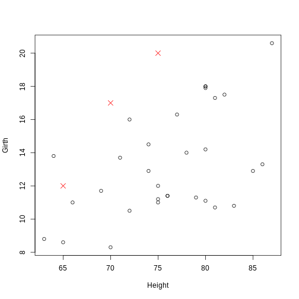
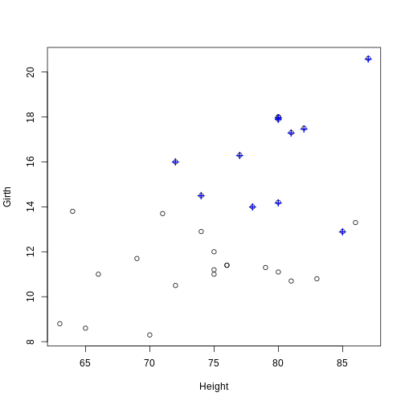
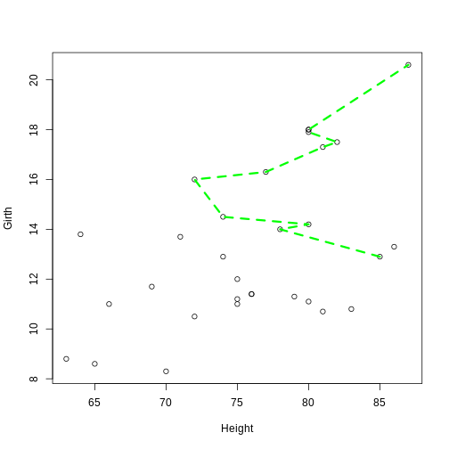

:::::::::::::::::::::::::::::::::::::: questions 

- How do you create and customize basic plots in R using base graphics?

::::::::::::::::::::::::::::::::::::::::::::::::

::::::::::::::::::::::::::::::::::::: objectives

- Understand low-level plotting functions.
- Be able to customize existing plots with low-level plotting functions.

::::::::::::::::::::::::::::::::::::::::::::::::

There are numerous low level plot functions in base graphics that add components to an existing plot.

**Caution**: Low level plot functions can only be used if there is already a plot open. If you run a low level plot command when there is not a plot already open, R will give you an error.

## Points

The `points()` function is used to add points to an existing plot. Similar to the basic form of `plot()`, the syntax is `points(x, y, ...)`, where `x` and `y` are numeric vectors that correspond to the coordinates of the points to add. The same optional arguments common to `plot()` can be used to specify the color, size, and type of the points. To demonstrate, we again use the built-in `trees` data set: 


``` r
plot(Girth ~ Height, data = trees)
points(c(65, 70, 75), c(12, 17, 20), pch = 4, col = "red", cex = 1.5)
```


The coordinate pairs can alternatively be specified using a a two-column matrix or data frame, a list with two components called `x` and `y`, or a formula `y ~ x`.

::::::::::::::::::::::::::::::::::::: challenge 

## Challenge 1: Can you do it?

Use the `points()`function to note which trees have an above average volume.
  

:::::::::::::::::::::::: solution 

## Solution
 

``` r
# Find the observations (trees) with an above average (mean) volume
volume_index <- with(trees, Volume > mean(Volume))
# Plot the tree girths against height
plot(Girth ~ Height, data = trees)
# Add a blue + to the observations with an above average volume
points(Girth ~ Height, data = trees[volume_index, ], pch = "+", col = "blue", cex = 1.5)
```



::::::::::::::::::::::::

::::::::::::::::::::::::::::::::::::::::::::::::


## Lines

The `lines()` function is used to add connected line segments to an existing plot. The syntax is identical to `points()`, but the output will connect specified coordinates by straight line segments.


``` r
plot(Girth ~ Height, data = trees) 
# Self-generated points
coords_mat <- cbind(c(65, 70, 75), c(12, 17, 20))
lines(coords_mat, col = "purple")
```


**Notice:** Even though `lines()` and `points()` are separate functions, the functionality of both are actually the same. The `points()` function can be used to add line segments by setting the optional argument `type = "l"`. The `lines()` function can be used to add points by setting the optional argument `type = "p"`.

Lines constructed in base graphics functions (like plot() or lines()) can be modified using line-specific optional arguments. Commonly used arguments are:

  - **lty**: The lty argument controls the line type. Line types can either be specified as an integer (0 is blank, 1 is solid (default), 2 is dashed, 3 is dotted, 4 is dotdash, 5 is longdash, and 6 is twodash) or as one of the character values "blank", "solid", "dashed", "dotted", "dotdash", "longdash", or "twodash", where "blank" uses “invisible lines” (i.e., the lines are not drawn).
  - **lwd**: The lwd argument controls the line width. Similar to the cex argument for points, the value corresponds to the amount by which the line width should be scaled relative to the default of `lwd = 1`. Values above 1 will make the line wider, and values below 1 will make the line thinner. 


``` r
plot(Girth ~ Height, data = trees)
lines(Girth ~ Height, data = trees[volume_index, ], col = "green", lty = 2, lwd = 3)
```


**Notice:**The `lines()` function can also be used to add a smooth density curve over a relative frequency histogram (prob = TRUE). The `density()` function computes a kernel density estimate of the data, which can be visualized as a smooth curve superimposed over a histogram using the `lines()` function.

::::::::::::::::::::::::::::::::::::: challenge 

## Challenge 2

Can you create a histogram of `Girth` with relative frequencies and then use the `lines()` function to add a smooth density curve over the histogram?

:::::::::::::::::::::::: solution 

## Solution
 

``` r
hist(trees$Girth, prob = TRUE, main = "Histogram of Tree Girth with Density Curve", xlab = "Girth")
lines(density(trees$Girth), lwd = 2, col = "blue")
```


::::::::::::::::::::::::

::::::::::::::::::::::::::::::::::::::::::::::::


::::::::::::::::::::::::::::::::::::: keypoints 

- Know how to add points to an existing plot using the points() function
- Know how to add connected line segments to an existing plot using the lines() function
- Understand how to use the lines() function to add points by setting the type argument to "p"
- Learn how to add a smooth density curve over a histogram
::::::::::::::::::::::::::::::::::::::::::::::::

[r-markdown]: https://rmarkdown.rstudio.com/
